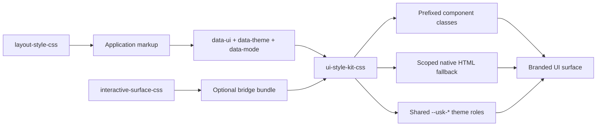
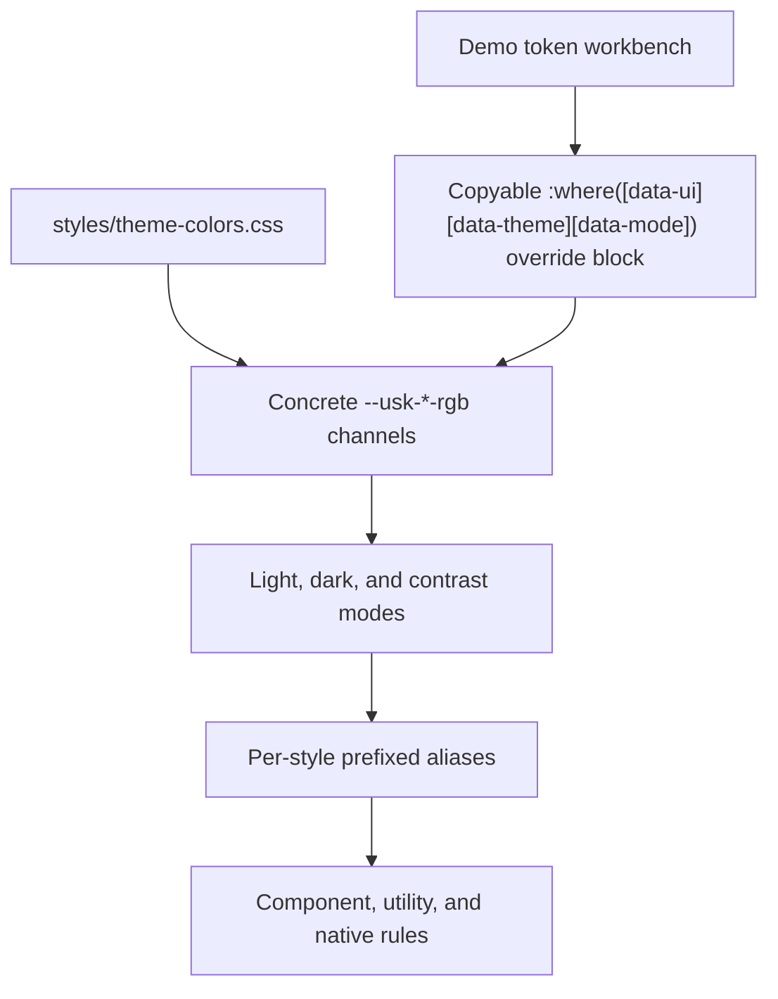

# UI Style Kit CSS

[](https://www.npmjs.com/package/ui-style-kit-css)
[](./LICENSE)

**UI Style Kit CSS** is a CSS-only theme and UI style preset library for accessible websites, dashboards, admin interfaces, and customer-facing pages.

It is separate from, but complementary to, **Interactive Surface CSS**. Use **UI Style Kit CSS** for visual identity, color themes, UI presets, layout mood, and native HTML styling. Use **Interactive Surface CSS** for interaction-state animation systems and surface behavior.

## Current Release

`v2.1.0` introduces a visual-only public API, a machine-readable capability manifest, a five-layer build architecture, and a canonical token-only Interactive Surface theme bridge. Existing default and focused entrypoints remain compatible, including their deprecated structural helpers, and parser-based minification remains exactly pinned.

[Showcase website](https://foscat.github.io/ui-style-kit-css/)

## How the library fits together

UI Style Kit CSS owns visual identity: themes, component paint, native HTML styling, and the prefixed class API. It can be used alone, or paired with the sibling libraries when a project needs structural layout primitives or richer interaction-state behavior.





The demo page documents this flow directly: it shows computed RGB color tokens for the active theme and mode, lets developers edit them live, and copies the exact override block to drop into an app stylesheet.

## Ecosystem compatibility

These libraries stay standalone, but the current aligned set is:

| Library | Aligned version | Owns |
|---|---:|---|
| `ui-style-kit-css@2.1.0` | published release | visual identity, color themes, UI paint, native HTML styling, content wrapping, and bridge tokens |
| `interactive-surface-css@1.5.0` | published release | interaction-state primitives, surface behavior, state layers, and input affordances |
| `layout-style-css@3.0.0` | published release | structural wrappers, grids, sections, app shells, and layout recipes |

UI Style Kit `2.1.0`, Interactive Surface `1.5.0`, and Layout Style `3.0.0` are released companion packages for this integration contract.

Use one, two, or all three depending on the project. UI Style Kit does not require the sibling libraries, and the optional bridge only maps shared `--usk-*` roles into Interactive Surface tokens when consumers import it.

For import order, ownership boundaries, and adoption paths, see the [Ecosystem guide](docs/ECOSYSTEM.md).

## Features

- 11 UI style systems
- 10 shared color schemes
- `light`, `dark`, and `contrast` modes
- Combined CSS bundle and per-style production imports
- Visual-only full and focused entrypoints for consumer-owned layouts
- Machine-readable `manifest.json` preset, theme, mode, class, and native-part capabilities
- Shared `theme-colors.css`, `native-elements.css`, and `content-overflow.css` layers for all UI systems
- Scoped native HTML element coverage, including semantic containers and inline text elements
- Visible `:focus-visible` defaults
- Skip-link and visually-hidden helpers per style prefix
- Compact shared palette -> prefixed alias -> UI-rule token model
- Theme-driven card, panel, control, page-background, and spinner defaults
- Visible tooltip classes and native `[role="tooltip"]` styling inside each UI scope
- Font-family override variables for body, headings, controls, and mono text
- Canonical token-and-paint-only theme bridge for `interactive-surface-css/state-core.css`
- Deprecated stateful bridge exports retained unchanged for backward compatibility
- Reduced-motion, high-contrast, forced-colors, and print support
- Cascade-layered CSS for easier consumer overrides
- No runtime dependencies

## Install

```bash
npm install ui-style-kit-css
```

## Import

Use a single style import for production apps that use one visual system:

```js
import "ui-style-kit-css/minimal-saas.css";
```

The existing focused entrypoints retain the v2 structural helpers. New integrations that already own layout should use a focused visual-only entrypoint:

```js
import "ui-style-kit-css/visual/minimal-saas.css";
```

Use `ui-style-kit-css/visual.css` for runtime preset switching without the deprecated prefixed layout selectors. The exact preset, theme, mode, class, and native-part capability matrix is available from `ui-style-kit-css/manifest.json`.

In `v2.1.0`, legacy standalone style files continue to import the shared color-scheme, native-element fallback, and content-overflow layers. Bundlers that understand CSS `@import` resolve them automatically. If your build pipeline does not resolve CSS imports, import the shared dependencies before the style file:

```js
import "ui-style-kit-css/theme-colors.css";
import "ui-style-kit-css/native-elements.css";
import "ui-style-kit-css/content-overflow.css";
import "ui-style-kit-css/minimal-saas.css";
```

The longer `styles/*` paths are also exported:

```js
import "ui-style-kit-css/styles/minimal-saas.css";
import "ui-style-kit-css/styles/cyberpunk.css";
```

Use the full bundle when users need to switch `data-ui` systems at runtime:

```js
import "ui-style-kit-css/dist/ui-style-kit.css";
```

For the canonical all-three integration, import visual paint, the token-only theme bridge, Interactive Surface state mechanics, and Layout structure in this order:

```js
import "ui-style-kit-css/visual.css";
import "ui-style-kit-css/interactive-surface-theme.css";
import "interactive-surface-css/state-core.css";
import "layout-style-css";
```

The older stateful bridge and combined bundle remain public, deprecated compatibility paths. See the [bridge migration guide](docs/BRIDGE-MIGRATION.md) when upgrading an existing v2 integration.

The default and visual-only bundles do **not** include either bridge. That keeps UI paint independent and prevents accidental duplicate bridge imports.

When the bridge is attached, add `.interactive-surface` to interactable elements and use `data-surface-variant` plus `data-surface-level="1"`, `"2"`, or `"3"` to opt into the visible rest, hover, active, and focus treatments. The bridge inherits from shared `--usk-*` roles instead of duplicating per-theme or per-preset token maps.

### Bundle size guide

| Import | Raw | Gzip | Best for |
|---|---:|---:|---|
| `ui-style-kit-css/dist/ui-style-kit.min.css` | ~299 KB | ~39 KB | Compatible runtime UI-system switchers and demos |
| `ui-style-kit-css/visual.min.css` | ~290 KB | ~38 KB | Runtime visual switching with consumer-owned layout |
| `ui-style-kit-css/with-bridge.css` | ~369 KB | ~44 KB | Deprecated runtime switcher plus stateful bridge |
| `ui-style-kit-css/theme-colors.css` | ~25 KB | ~3 KB | Shared color schemes for standalone style imports |
| `ui-style-kit-css/native-elements.css` | ~21 KB | ~3 KB | Shared native HTML fallback styling |
| `ui-style-kit-css/content-overflow.css` | ~7 KB | ~1 KB | Shared long-text containment for standalone style imports |
| `ui-style-kit-css/interactive-surface-theme.css` | ~8 KB | ~1 KB | Canonical token-and-paint bridge for Interactive Surface state core |
| Single style imports | ~26-28 KB | ~5-6 KB | Production apps with one visual system |

## CDN usage

Use the latest published NPM package:

```html
<link rel="stylesheet" href="https://cdn.jsdelivr.net/npm/ui-style-kit-css@latest/dist/ui-style-kit.min.css" />
```

For production, pin the exact approved release rather than relying on `latest`:

```html
<link rel="stylesheet" href="https://cdn.jsdelivr.net/npm/ui-style-kit-css@2.1.0/dist/ui-style-kit.min.css" />
```

## Basic usage

```html
<body data-ui="minimal-saas" data-theme="arctic-indigo" data-mode="light">
  <main class="saas-page">
    <section class="saas-container saas-stack">
      <article class="saas-card">
        <h1 class="saas-title">UI Style Kit CSS</h1>
        <p class="saas-subtitle">Switch UI systems, themes, and modes with attributes.</p>
        <button class="saas-button saas-button-primary">Primary Action</button>
        <span class="saas-spinner" aria-label="Loading"></span>
      </article>
    </section>
  </main>
</body>
```

## Dynamic switching

```js
document.body.dataset.ui = "cyberpunk";
document.body.dataset.theme = "midnight-gold";
document.body.dataset.mode = "dark";
```

## UI systems

| UI style | `data-ui` | Class prefix | Best for |
|---|---:|---:|---|
| Minimal SaaS | `minimal-saas` | `saas` | dashboards, admin tools, SaaS apps |
| Bento UI | `bento` | `bento` | landing pages, feature sections, showcases |
| Maximalist / Playful | `maximalist` | `max` | creators, entertainment, bold client sites |
| Bauhaus / Swiss Modern | `bauhaus` | `bau` | agencies, editorial layouts, design-forward brands |
| Skeuomorphic / Tactile | `tactile` | `tactile` | premium tactile interfaces, control panels |
| Neumorphism | `neumorphism` | `neo` | soft dashboards, experimental UI |
| Retrofuturism | `retrofuturism` | `retro` | futuristic portfolios and product pages |
| Brutalism | `brutalism` | `brutal` | bold creative websites |
| Cyberpunk | `cyberpunk` | `cyber` | security, gaming, encryption, tech demos |
| Y2K | `y2k` | `y2k` | nostalgic, playful, fashion/music/event sites |
| Retro Glass | `retro-glass` | `rg` | futuristic glass dashboards and hero sections |

## Color themes

```txt
midnight-gold
ocean-steel
forest-moss
sunset-ember
royal-plum
graphite-cyan
desert-sage
rose-quartz
cyber-lime
arctic-indigo
```

Color schemes are defined once in `styles/theme-colors.css` as shared `--usk-*` RGB roles. Each UI style maps those shared roles back to its public prefix, so existing component rules still consume variables such as `--saas-primary`, `--bau-surface`, and `--rg-on-primary`.

## Modes

```txt
light
dark
contrast
```

## Native HTML coverage

`styles/native-elements.css` owns the shared native selectors under `[data-ui][data-theme][data-mode]`. Each style system maps those selectors to its visual identity through `--usk-native-*` tokens, so native controls keep the same coverage while inheriting each preset's radius, shadows, borders, typography, and color surfaces.

`styles/content-overflow.css` owns the shared text containment contract under `[data-ui][data-theme][data-mode]`. It keeps headings, paragraphs, links, table cells, controls, badges, nav links, and common UI wrappers from widening their parent wrapper when content contains long words, hashes, URLs, or copyable tokens.

The shared native layer covers common native elements, including:

- semantic containers: `main`, `section`, `header`, `footer`, `nav`, `article`, `aside`, `address`
- headings, paragraphs, links, lists, definition lists, blockquotes, code, pre, mark, abbr
- inline semantics: `strong`, `b`, `em`, `i`, `cite`, `var`, `q`, `ins`, `del`, `s`, `sub`, `sup`, `output`, `time`, `data`, `dfn`, `ruby`, `rt`, `rp`
- images, media, figures, captions, `audio`, `picture`, `object`, `embed`, and `math`
- forms, fieldsets, labels, inputs, textareas, selects, checkboxes, radios, range, color, file inputs
- buttons and submit/reset controls
- tables and captions
- `details`, `summary`, `dialog`, `progress`, `meter`, `menu`, `search`, `optgroup`, and `option`
- loading indicators through `<prefix>-spinner`, `<prefix>-loading-spinner`, and busy native buttons with `aria-busy="true"`
- tooltip surfaces through `<prefix>-tooltip`, `<prefix>-tooltip-arrow`, `.ui-tooltip`, `[role="tooltip"]`, and `[data-tooltip]`

CSS improves accessibility presentation, but it cannot guarantee accessibility by itself. Use semantic HTML, real labels, keyboard-safe JavaScript, meaningful link/button text, and correct ARIA state management.

Semantic text utilities such as `saas-text-primary`, `saas-text-warning`, and `saas-text-danger` use the active theme palette directly. Filled UI such as buttons, badges, and busy states use compact `on-*` aliases like `--saas-on-primary` and `--saas-on-danger`.

For the full native-element and subpart support contract, including platform-owned picker and popup limitations, see [Native Element Coverage](docs/NATIVE-ELEMENTS.md).

## Loading states

Every style includes theme-driven spinner utilities:

```html
<span class="saas-spinner" aria-label="Loading"></span>
<span class="saas-loading-spinner saas-spinner-sm" aria-hidden="true"></span>
<button class="saas-button saas-button-primary" aria-busy="true">Saving</button>
```

Spinner track, stroke, and accent colors come from the active `data-theme` and `data-mode`. The generic `.ui-spinner`, `.loading-spinner`, and `[data-loading-spinner]` hooks are also themed inside any `[data-ui="..."]` scope.

## Tooltip surfaces

Every style includes visible tooltip utilities with the same API and preset-specific visual treatment:

```html
<span class="saas-tooltip" role="tooltip">
  Helpful context
  <span class="saas-tooltip-arrow" aria-hidden="true"></span>
</span>
```

Inside a `[data-ui="..."]` scope, generic `.ui-tooltip`, `[role="tooltip"]`, and `[data-tooltip]` hooks inherit the active UI system.

## Font overrides

Each style exposes backward-compatible base font variables plus more granular aliases:

```css
[data-ui="minimal-saas"] {
  --saas-font-sans: Inter, system-ui, sans-serif;
  --saas-font-display: Inter, system-ui, sans-serif;
  --saas-font-body: var(--saas-font-sans);
  --saas-font-heading: var(--saas-font-display);
  --saas-font-control: var(--saas-font-display);
  --saas-font-mono: "JetBrains Mono", ui-monospace, monospace;
}
```

Override `--<prefix>-font-sans` and `--<prefix>-font-display` for the broadest changes, or override `--<prefix>-font-body`, `--<prefix>-font-heading`, `--<prefix>-font-control`, and `--<prefix>-font-mono` for targeted typography control.

## Cascade layers

The library styles are wrapped in `@layer ui-style-kit.*`. Unlayered consumer CSS can override the library without specificity fights:

The declared order is `theme_colors`, `native_elements`, `components`, `presets`, then `compat_layout`. Visual-only entrypoints leave the final compatibility layer empty of deprecated structural selectors.

```css
[data-ui="minimal-saas"][data-theme="arctic-indigo"] {
  --saas-radius-md: 1rem;
  --saas-font-sans: Inter, system-ui, sans-serif;
  --saas-font-display: Inter, system-ui, sans-serif;
  --saas-font-body: var(--saas-font-sans);
  --saas-font-heading: var(--saas-font-display);
  --saas-font-control: var(--saas-font-display);
}

:where([data-ui][data-theme="arctic-indigo"][data-mode="light"]) {
  --usk-primary-rgb: 72 91 255;
  --usk-primary-hover-rgb: 55 75 230;
  --usk-primary-text-rgb: 255 255 255;
}
```

The color model is intentionally small: shared `--usk-*` RGB variables feed prefixed aliases such as `--<prefix>-bg`, `--<prefix>-text`, `--<prefix>-surface`, and `--<prefix>-border`. Filled components use `--<prefix>-on-primary`, `--<prefix>-on-secondary`, `--<prefix>-on-success`, `--<prefix>-on-warning`, and `--<prefix>-on-danger` for readable text over filled surfaces.

## File structure

```txt
ui-style-kit-css/
  package.json
  manifest.json
  README.md
  LICENSE
  CHANGELOG.md
  STYLE-MAP.md
  dist/
    ui-style-kit.css
    ui-style-kit.min.css
    ui-style-kit.visual.css
    ui-style-kit.visual.min.css
    ui-style-kit.with-bridge.css
    ui-style-kit.with-bridge.min.css
    visual/
      minimal-saas.css
      ...
  styles/
    theme-colors.css
    native-elements.css
    components.css
    compat-layout.css
    content-overflow.css
    minimal-saas.css
    bento.css
    maximalist.css
    bauhaus.css
    tactile.css
    neumorphism.css
    retrofuturism.css
    brutalism.css
    cyberpunk.css
    y2k.css
    retro-glass.css
    interactive-surface-theme.css
    interactive-surface-bridge.css
  docs/
    TOKENS.md
    STYLE-GUIDE.md
    PUBLISHING.md
```

The checked-in demo, favicon pack, and social preview image stay in the repository for GitHub Pages, but they are intentionally excluded from the npm tarball so installs only receive the CSS library, docs, and metadata.

## Development checks

```bash
npm run check
npm run test:e2e
npm run test:axe
npm run test:visual
npm run test:matrix
npm run pack:dry-run
```

`npm run check` rebuilds the bundles, runs stylelint, verifies package metadata, checks the documented class API, and validates contrast for base text/link pairs and filled component `on-*` pairs. Browser release gates add all-engine Playwright coverage, representative Axe scans, curated visual smoke checks, and the sharded `11 presets x 10 themes x 3 modes x 3 engines` matrix.

## v2.1.0 Architecture Notes

- Prefer `visual.css` or `visual/<preset>.css` when Layout Style CSS or application CSS owns structure.
- Existing root, minified, focused preset, `interactive-surface-bridge`, and `with-bridge` entrypoints preserve their v2 behavior.
- Treat `page`, `container`, `section`, `grid`, `stack`, `cluster`, and `split` suffixes as deprecated compatibility helpers; their removal is reserved for v3.
- Prefer `interactive-surface-theme.css` with `interactive-surface-css/state-core.css`. The old stateful bridge exports remain deprecated compatibility paths.

## v2.0.1 Migration Notes

The `v2.0.1` release line removes duplicated per-UI color-scheme blocks. Color schemes now live in `theme-colors.css` as shared `--usk-*` roles, native HTML fallback styling lives in `native-elements.css`, and each UI style aliases those shared roles back to its prefix.

- Use `--usk-*-rgb` when defining or overriding a color scheme.
- Continue using prefixed functional tokens such as `--saas-primary`, `--neo-card-bg`, and `--rg-on-primary` inside components.
- Import `ui-style-kit-css/theme-colors.css`, `ui-style-kit-css/native-elements.css`, and `ui-style-kit-css/content-overflow.css` before standalone style files if your bundler does not follow CSS `@import`.
- Existing v2.0.1 integrations can keep using `ui-style-kit-css/interactive-surface-bridge` or `ui-style-kit-css/with-bridge.css`; those stateful compatibility paths are deprecated in v2.1.0. New integrations should compose the visual, theme-bridge, and state-core entrypoints documented above.

## License

MIT
