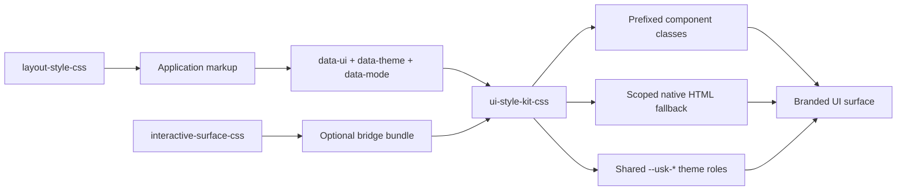
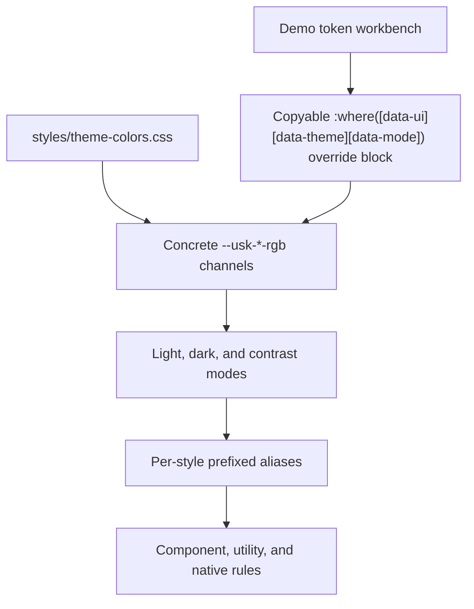

# UI Style Kit CSS

[](https://www.npmjs.com/package/ui-style-kit-css)
[](./LICENSE)

**UI Style Kit CSS** is a CSS-only theme and UI style preset library for accessible websites, dashboards, admin interfaces, and customer-facing pages.

It is separate from, but complementary to, **Interactive Surface CSS** and **Layout Style CSS**. Use **UI Style Kit CSS** for visual identity, color themes, UI presets, layout mood, and native HTML styling. Use **Interactive Surface CSS** for interaction-state animation systems and surface behavior. Use **Layout Style CSS** for responsive layout wrappers, grid systems, macro-structure positioning, and container scaffolding.

## Current Release

`v2.4.0` gives all 20 UI style systems a complete native-control identity across selects, choices, ranges, progress, meters, file/color/date launch controls, indicators, and scrollbars. Existing themes, modes, selectors, default/focused/visual/bridge entrypoints, and the 3,600-case browser matrix remain compatible, and parser-based minification remains exactly pinned.

[Showcase website](https://foscat.github.io/ui-style-kit-css/)

## How the library fits together

UI Style Kit CSS owns visual identity: themes, semantic `.ui-*` component paint, native HTML styling, and the advanced prefixed class API. It can be used alone, or paired with the sibling libraries when a project needs structural layout primitives or richer interaction-state behavior.





The demo page documents this flow directly: it shows computed RGB color tokens for the active theme and mode, lets developers edit them live, and copies the exact override block to drop into an app stylesheet.

## Ecosystem compatibility

These libraries stay standalone, but the current aligned set is:

| Library | Aligned version | Owns |
|---|---:|---|
| `ui-style-kit-css@2.4.0` | current release target | visual identity, color themes, UI paint, native HTML styling, content wrapping, and bridge tokens |
| `interactive-surface-css@1.6.0` | compatible state release | interaction-state primitives, surface behavior, state layers, and input affordances |
| `layout-style-css@3.1.0` | compatible structural release | structural wrappers, grids, sections, app shells, and layout recipes |

UI Style Kit `2.4.0` is the current release target and is verified with Interactive Surface `1.6.0`. Layout Style `3.1.0` is the compatible structural release. The validated minimum remains `ui-style-kit-css@2.1.0`, `interactive-surface-css@1.5.0`, and `layout-style-css@3.0.0`.

Use one, two, or all three depending on the project. UI Style Kit does not require the sibling libraries, and the optional bridge only maps shared `--usk-*` roles into Interactive Surface tokens when consumers import it.

Every UI Style Kit visual or preset entrypoint also publishes a small, fully typed `--ui-*` semantic handshake. These tokens let companion libraries and third-party themes share paint, control geometry, focus, and default motion without depending on preset-specific names. They are optional fallbacks for consumers: package-specific tokens still take precedence, and standalone packages keep their existing legacy and literal defaults when the handshake is absent. See the [token contract](docs/TOKENS.md#shared-semantic-token-handshake) for the exact 12-token inventory.

A third-party producer can load its semantic token stylesheet before `interactive-surface-css/standalone-preset.css`. UI Style Kit's visual entrypoints support the same portable composition; keep the canonical theme bridge with `state-core.css` when specialized variant, level, and icon-role mappings are required.

For import order, ownership boundaries, and adoption paths, see the [Ecosystem guide](docs/ECOSYSTEM.md).

## Features

- 20 UI style systems
- 20 shared color schemes
- `light`, `dark`, and `contrast` modes
- Combined CSS bundle and per-style production imports
- Visual-only full and focused entrypoints for consumer-owned layouts
- Machine-readable `manifest.json` preset, theme, mode, class, and native-part capabilities
- Shared `theme-colors.css`, `native-elements.css`, and `content-overflow.css` layers for all UI systems
- Scoped native HTML element coverage, including semantic containers and inline text elements
- Visible `:focus-visible` defaults
- Skip-link and visually-hidden helpers per style prefix
- Compact shared palette -> prefixed alias -> UI-rule token model
- Theme-driven card, panel, control, page-background, and spinner defaults
- Visible tooltip classes and native `[role="tooltip"]` styling inside each UI scope
- Font-family override variables for body, headings, controls, and mono text
- Canonical token-and-paint-only theme bridge for `interactive-surface-css/state-core.css`
- Deprecated stateful bridge exports retained for backward compatibility
- Reduced-motion, high-contrast, forced-colors, and print support
- Cascade-layered CSS for easier consumer overrides
- No runtime dependencies

## Install

```bash
npm install ui-style-kit-css
```

### v2 distribution defaults

The default bundle remains unchanged for all v2 releases. The root package and canonical `.` export resolve to the readable `dist/ui-style-kit.css`; the canonical `./min.css` export resolves to the minified `dist/ui-style-kit.min.css`. The focused `visual/<preset>.css` entrypoints remain available for applications fixed to one visual system.

`ui-style-kit-css/visual.css` is the recommended entrypoint when consumers own layout. Making `visual.css` the package default remains only a v3 proposal; no v2 export is redirected as part of that proposal.

The `./css`, `./css.css`, and `./min` exports are redundant deprecated compatibility aliases. They remain available throughout v2 with their existing targets: `./css` and `./css.css` match `.`, while `./min` matches `./min.css`. New integrations should use the canonical exports.

## Import

Use the generated default bundle for semantic components that can switch across every preset at runtime:

```js
import "ui-style-kit-css";
```

Use `ui-style-kit-css/visual.css` for the same 29-selector semantic runtime API without the deprecated prefixed layout selectors. The generated default, visual, and with-bridge bundles all support all 20 `data-ui` values.

Applications fixed to one preset can use a generated focused visual entrypoint. It includes semantic aliases scoped to that preset only:

```js
import "ui-style-kit-css/visual/minimal-saas.css";
```

The exact preset, theme, mode, class, and native-part capability matrix is available from `ui-style-kit-css/manifest.json`.

### Advanced prefixed and raw imports

The standalone preset exports and longer `styles/*` paths remain advanced compatibility entrypoints. They preserve the prefixed API and do not promise multi-preset semantic switching:

```js
import "ui-style-kit-css/minimal-saas.css";
// Equivalent raw source export:
import "ui-style-kit-css/styles/minimal-saas.css";
```

Compatible standalone style files continue to import the shared color-scheme, native-element fallback, and content-overflow layers. Bundlers that understand CSS `@import` resolve them automatically. If your build pipeline does not resolve CSS imports, import the shared dependencies before the style file:

```js
import "ui-style-kit-css/theme-colors.css";
import "ui-style-kit-css/native-elements.css";
import "ui-style-kit-css/content-overflow.css";
import "ui-style-kit-css/minimal-saas.css";
```

The explicit distribution path is also available for runtime switching:

```js
import "ui-style-kit-css/dist/ui-style-kit.css";
```

For the canonical all-three integration, import visual paint, the token-only theme bridge, Interactive Surface state mechanics, and Layout structure in this order:

```js
import "ui-style-kit-css/visual.css";
import "ui-style-kit-css/interactive-surface-theme.css";
import "interactive-surface-css/state-core.css";
import "layout-style-css";
```

The older stateful bridge and combined bundle remain public, deprecated compatibility paths. See the [bridge migration guide](docs/BRIDGE-MIGRATION.md) when upgrading an existing v2 integration.

The default and visual-only bundles do **not** include either bridge. That keeps UI paint independent and prevents accidental duplicate bridge imports.

When the bridge is attached, add `.interactive-surface` to interactable elements and use `data-surface-variant` plus `data-surface-level="1"`, `"2"`, or `"3"` to opt into the visible rest, hover, active, and focus treatments. The bridge inherits from shared `--usk-*` roles instead of duplicating per-theme or per-preset token maps.

### Bundle size guide

| Import | Raw | Gzip | Best for |
|---|---:|---:|---|
| `ui-style-kit-css/dist/ui-style-kit.min.css` | ~916 KB | ~138 KB | Compatible runtime UI-system switchers and demos |
| `ui-style-kit-css/visual.min.css` | ~902 KB | ~136 KB | Runtime visual switching with consumer-owned layout |
| `ui-style-kit-css/with-bridge.css` | ~1082 KB | ~154 KB | Deprecated runtime switcher plus stateful bridge |
| `ui-style-kit-css/theme-colors.css` | ~50 KB | ~6 KB | Shared color schemes for standalone style imports |
| `ui-style-kit-css/native-elements.css` | ~32 KB | ~5 KB | Shared native HTML fallback styling |
| `ui-style-kit-css/content-overflow.css` | ~20 KB | ~3 KB | Shared long-text containment for standalone style imports |
| `ui-style-kit-css/interactive-surface-theme.css` | ~8 KB | ~1 KB | Canonical token-and-paint bridge for Interactive Surface state core |
| Single style imports | ~26-28 KB | ~5-6 KB | Production apps with one visual system |

## CDN usage

Use the latest published NPM package:

```html
<link rel="stylesheet" href="https://cdn.jsdelivr.net/npm/ui-style-kit-css@latest/dist/ui-style-kit.min.css" />
```

For production, pin the exact approved release rather than relying on `latest`:

```html
<link rel="stylesheet" href="https://cdn.jsdelivr.net/npm/ui-style-kit-css@2.4.0/dist/ui-style-kit.min.css" />
```

## Basic usage

```html
<body data-ui="minimal-saas" data-theme="arctic-indigo" data-mode="light">
  <main>
    <article class="ui-card">
      <h1>UI Style Kit CSS</h1>
      <p>Switch UI systems, themes, and modes without changing component classes.</p>
      <button class="ui-button" data-ui-variant="primary">Primary Action</button>
      <span class="ui-spinner" role="status" aria-label="Loading"></span>
    </article>
  </main>
</body>
```

## Dynamic switching

```js
document.body.dataset.ui = "cyberpunk";
document.body.dataset.theme = "midnight-gold";
document.body.dataset.mode = "dark";
```

This changes the semantic components' visual preset without replacing their DOM nodes or rewriting their `.ui-*` classes.

## Semantic component API

`manifest.json#semanticComponentApi` is the authoritative specification for the implemented generic component API. Its 29 selectors keep the same class names while `data-ui` changes across all 20 presets. `implementationStatus` records the two retained `.ui-spinner` and `.ui-tooltip` hooks, the 27 generated semantic aliases, and an empty pending set.

| Role | Generic selectors | Switching coverage |
|---|---|---|
| Buttons | `.ui-button`, `.ui-icon-button` | all 20 presets |
| Card | `.ui-card` | all 20 presets |
| Forms | `.ui-field`, `.ui-label`, `.ui-help-text`, `.ui-input`, `.ui-select`, `.ui-textarea` | all 20 presets |
| Choice controls | `.ui-check`, `.ui-check-control`, `.ui-radio`, `.ui-radio-control`, `.ui-switch`, `.ui-switch-track`, `.ui-switch-thumb` | all 20 presets |
| Badge | `.ui-badge` | all 20 presets |
| Alert | `.ui-alert`, `.ui-alert-title`, `.ui-alert-body` | all 20 presets |
| Navigation | `.ui-nav`, `.ui-nav-link` | all 20 presets |
| Table | `.ui-table`, `.ui-table-wrap` | all 20 presets |
| Progress | `.ui-progress`, `.ui-progress-bar` | all 20 presets |
| Toolbar | `.ui-toolbar` | all 20 presets |
| Existing generic hooks | `.ui-spinner`, `.ui-tooltip` | all 20 presets |

The only new attribute is context-constrained `data-ui-variant`. Omit it for the neutral treatment.

| Selector | `data-ui-variant` values |
|---|---|
| `.ui-button` | `primary`, `secondary`, `danger`, `ghost` |
| `.ui-badge` | `primary`, `secondary`, `success`, `warning`, `danger` |
| `.ui-alert` | `success`, `warning`, `danger` |

```html
<body data-ui="minimal-saas" data-theme="arctic-indigo" data-mode="light">
  <button class="ui-button" data-ui-variant="primary">Save</button>
  <article class="ui-card">...</article>
</body>
```

Modal and dialog roles deliberately use a neutral native `<dialog>` fallback. There is no `.ui-modal` or `.ui-dialog` selector. The semantic API also does not define `data-ui-state`, `data-ui-size`, or `data-ui-placement`; continue to use native and ARIA state hooks, `.is-active`, and `[data-ui-tooltip-anchor]` where supported.

Preset-prefixed classes remain supported compatibility and advanced APIs. Partial preset extras, typography and paint utilities, surface/size/placement helpers, shape and accessibility utilities, and the deprecated `page`, `container`, `section`, `grid`, `stack`, `cluster`, and `split` structural aliases remain prefix-bound rather than entering the generic contract.

For example, a fixed Minimal SaaS integration may continue to use `<button class="saas-button saas-button-primary">`. Prefer `.ui-button` plus `data-ui-variant="primary"` when markup must survive runtime preset changes.

## UI systems

| UI style | `data-ui` | Class prefix | Best for |
|---|---:|---:|---|
| Minimal SaaS | `minimal-saas` | `saas` | dashboards, admin tools, SaaS apps |
| Bento UI | `bento` | `bento` | landing pages, feature sections, showcases |
| Maximalist / Playful | `maximalist` | `max` | creators, entertainment, bold client sites |
| Bauhaus / Swiss Modern | `bauhaus` | `bau` | agencies, editorial layouts, design-forward brands |
| Skeuomorphic / Tactile | `tactile` | `tactile` | premium tactile interfaces, control panels |
| Neumorphism | `neumorphism` | `neo` | soft dashboards, experimental UI |
| Retrofuturism | `retrofuturism` | `retro` | futuristic portfolios and product pages |
| Brutalism | `brutalism` | `brutal` | bold creative websites |
| Cyberpunk | `cyberpunk` | `cyber` | security, gaming, encryption, tech demos |
| Y2K | `y2k` | `y2k` | nostalgic, playful, fashion/music/event sites |
| Retro Glass | `retro-glass` | `rg` | futuristic glass dashboards and hero sections |
| Editorial Luxe | `editorial-luxe` | `luxe` | luxury brands, architecture, hospitality, premium editorial sites |
| Organic Modern | `organic-modern` | `organic` | wellness, sustainability, hospitality, natural product brands |
| Industrial Utility | `industrial-utility` | `utility` | operations software, manufacturing, logistics, fleet and equipment systems |
| Technical Blueprint | `technical-blueprint` | `blueprint` | engineering, architecture, technical documentation, scientific tools |
| Art Deco | `art-deco` | `deco` | luxury, hospitality, heritage brands, events and distinctive showcases |
| Clay | `clay` | `clay` | friendly SaaS, collaborative tools, education and approachable product sites |
| Data Terminal | `data-terminal` | `terminal` | operator consoles, telemetry, infrastructure, monitoring and developer tools |
| Paper Editorial | `paper-editorial` | `paper` | news, magazines, journals, cultural sites and story-led publishing |
| Neo-Noir | `neo-noir` | `noir` | cinematic portfolios, nightlife, premium creative studios and dramatic product sites |

## Color themes

```txt
midnight-gold
ocean-steel
forest-moss
sunset-ember
royal-plum
graphite-cyan
desert-sage
rose-quartz
cyber-lime
arctic-indigo
chrome-navy
recycled-emerald
industrial-orange
performance-red
heritage-brass
service-blue-red
newsprint-crimson
foundry-amber
soft-orchid
electric-noir
```

Color schemes are defined once in `styles/theme-colors.css` as shared `--usk-*` RGB roles. Each UI style maps those shared roles back to its public prefix, so existing component rules still consume variables such as `--saas-primary`, `--bau-surface`, and `--rg-on-primary`.

## Commercial component modifiers

The cross-style API also includes reusable marketing and service-site patterns. These suffixes are available for all 20 UI systems and inherit the active `data-theme` / `data-mode` palette:

```txt
card-media
card-service
card-feature
card-accent-edge
icon-medallion
button-cut
button-outline-heavy
badge-seal
feature-strip
feature-item
callout-bar
eyebrow
media-scrim
```

Combine them with the preset prefix and existing base components:

```html
<article class="saas-card saas-card-service">
  
  <span class="saas-icon-medallion" aria-hidden="true">★</span>
  <p class="saas-eyebrow">Professional Service</p>
  <h3 class="saas-heading">A reusable service card</h3>
  <p class="saas-copy">The visual treatment changes with the selected UI system.</p>
  <a class="saas-button saas-button-primary saas-button-cut" href="#">Learn More</a>
</article>
```

The components intentionally contain no domain-specific content. Icons, media, labels, and copy remain consumer-owned.

### Component composition

- Service cards combine the base `card` with `card-service`; add `card-media` for responsive media, `icon-medallion` for an overlapping symbol, and `button-primary button-cut` for the filled service action.
- Feature cards use `card-feature` or `card-accent-edge` when information needs a stronger preset-specific edge treatment without changing the semantic element.
- Media treatments place an image and its caption inside `media-scrim`. The scrim supplies readable theme-token paint; the image and alternative text remain application content.
- Feature strips contain one or more `feature-item` children. They use balanced columns when space permits and collapse without requiring a new class.
- Callout bars use `callout-bar` as the visual lane and `button-outline-heavy` for the framed supporting action. There is no separate `button-cta` API.

`button-cut` and `button-outline-heavy` are independent modifiers: the first supplies the preset's filled-action silhouette and the second supplies its framed-action geometry and material. Do not combine them unless a deliberate hybrid is required. The same preset identity continues through service cards, media scrims, feature strips, callout bars, native action controls, and dialogs; color still comes only from the active theme and mode tokens.

All modifiers consume the active theme and mode tokens. Keep controls as real links or buttons, provide useful accessible names, mark decorative medallions with `aria-hidden="true"`, and avoid placing essential text in CSS artwork. The shared containment layer allows cards, strips, scrims, callouts, controls, and preset-specific specimens to shrink inside consumer-owned grids; application layout remains responsible for choosing the outer column count.

## Modes

```txt
light
dark
contrast
```

## Native HTML coverage

`styles/native-elements.css` owns the shared native selectors under `[data-ui][data-theme][data-mode]`. Each style system maps the complete `--usk-native-*` identity contract, so choices, selects, ranges, progress, meters, file/color/date launch controls, indicators, and scrollbars inherit preset-specific geometry, material, borders, depth, typography, and theme-owned color. Browser/OS popup internals remain platform-owned.

`styles/content-overflow.css` owns the shared text containment contract under `[data-ui][data-theme][data-mode]`. It keeps headings, paragraphs, links, table cells, controls, badges, nav links, and common UI wrappers from widening their parent wrapper when content contains long words, hashes, URLs, or copyable tokens.

The shared native layer covers common native elements, including:

- semantic containers: `main`, `section`, `header`, `footer`, `nav`, `article`, `aside`, `address`
- headings, paragraphs, links, lists, definition lists, blockquotes, code, pre, mark, abbr
- inline semantics: `strong`, `b`, `em`, `i`, `cite`, `var`, `q`, `ins`, `del`, `s`, `sub`, `sup`, `output`, `time`, `data`, `dfn`, `ruby`, `rt`, `rp`
- images, media, figures, captions, `audio`, `picture`, `object`, `embed`, and `math`
- forms, fieldsets, labels, inputs, textareas, selects, checkboxes, radios, range, color, file inputs
- buttons and submit/reset controls
- tables and captions
- `details`, `summary`, `dialog`, `progress`, `meter`, `menu`, `search`, `optgroup`, and `option`
- loading indicators through `<prefix>-spinner`, `<prefix>-loading-spinner`, and busy native buttons with `aria-busy="true"`
- tooltip surfaces through `<prefix>-tooltip`, `<prefix>-tooltip-arrow`, `.ui-tooltip`, `[role="tooltip"]`, and `[data-tooltip]`

CSS improves accessibility presentation, but it cannot guarantee accessibility by itself. Use semantic HTML, real labels, keyboard-safe JavaScript, meaningful link/button text, and correct ARIA state management.

Semantic text utilities such as `saas-text-primary`, `saas-text-warning`, and `saas-text-danger` use the active theme palette directly. Filled UI such as buttons, badges, and busy states use compact `on-*` aliases like `--saas-on-primary` and `--saas-on-danger`.

For the full native-element and subpart support contract, including platform-owned picker and popup limitations, see [Native Element Coverage](docs/NATIVE-ELEMENTS.md).

## Loading states

Every style includes theme-driven spinner utilities:

```html
<span class="saas-spinner" aria-label="Loading"></span>
<span class="saas-loading-spinner saas-spinner-sm" aria-hidden="true"></span>
<button class="saas-button saas-button-primary" aria-busy="true">Saving</button>
```

Spinner track, stroke, and accent colors come from the active `data-theme` and `data-mode`, while geometry, motion cadence, depth, and busy-button indicators follow the active UI preset. The generic `.ui-spinner`, `.loading-spinner`, and `[data-loading-spinner]` hooks receive the same preset identity inside any `[data-ui="..."]` scope.

## Tooltip surfaces

Every style includes visible tooltip utilities with the same API and preset-specific visual treatment:

```html
<span class="saas-tooltip" role="tooltip">
  Helpful context
  <span class="saas-tooltip-arrow" aria-hidden="true"></span>
</span>
```

Inside a `[data-ui="..."]` scope, generic `.ui-tooltip`, `[role="tooltip"]`, and `[data-tooltip]` hooks inherit the active UI system.

## Font overrides

Each style exposes backward-compatible base font variables plus more granular aliases:

```css
[data-ui="minimal-saas"] {
  --saas-font-sans: Inter, system-ui, sans-serif;
  --saas-font-display: Inter, system-ui, sans-serif;
  --saas-font-body: var(--saas-font-sans);
  --saas-font-heading: var(--saas-font-display);
  --saas-font-control: var(--saas-font-display);
  --saas-font-mono: "JetBrains Mono", ui-monospace, monospace;
}
```

Override `--<prefix>-font-sans` and `--<prefix>-font-display` for the broadest changes, or override `--<prefix>-font-body`, `--<prefix>-font-heading`, `--<prefix>-font-control`, and `--<prefix>-font-mono` for targeted typography control.

## Cascade layers

The library styles are wrapped in `@layer ui-style-kit.*`. Unlayered consumer CSS can override the library without specificity fights:

The declared order is `theme_colors`, `native_elements`, `components`, `presets`, then `compat_layout`. Visual-only entrypoints leave the final compatibility layer empty of deprecated structural selectors.

```css
[data-ui="minimal-saas"][data-theme="arctic-indigo"] {
  --saas-radius-md: 1rem;
  --saas-font-sans: Inter, system-ui, sans-serif;
  --saas-font-display: Inter, system-ui, sans-serif;
  --saas-font-body: var(--saas-font-sans);
  --saas-font-heading: var(--saas-font-display);
  --saas-font-control: var(--saas-font-display);
}

:where([data-ui][data-theme="arctic-indigo"][data-mode="light"]) {
  --usk-primary-rgb: 72 91 255;
  --usk-primary-hover-rgb: 55 75 230;
  --usk-primary-text-rgb: 255 255 255;
}
```

The color model is intentionally small: shared `--usk-*` RGB variables feed prefixed aliases such as `--<prefix>-bg`, `--<prefix>-text`, `--<prefix>-surface`, and `--<prefix>-border`. Filled components use `--<prefix>-on-primary`, `--<prefix>-on-secondary`, `--<prefix>-on-success`, `--<prefix>-on-warning`, and `--<prefix>-on-danger` for readable text over filled surfaces.

## File structure

```txt
ui-style-kit-css/
  package.json
  manifest.json
  README.md
  LICENSE
  CHANGELOG.md
  STYLE-MAP.md
  dist/
    ui-style-kit.css
    ui-style-kit.min.css
    ui-style-kit.visual.css
    ui-style-kit.visual.min.css
    ui-style-kit.with-bridge.css
    ui-style-kit.with-bridge.min.css
    visual/
      minimal-saas.css
      ...
  styles/
    theme-colors.css
    native-elements.css
    components.css
    compat-layout.css
    content-overflow.css
    minimal-saas.css
    bento.css
    maximalist.css
    bauhaus.css
    tactile.css
    neumorphism.css
    retrofuturism.css
    brutalism.css
    cyberpunk.css
    y2k.css
    retro-glass.css
    interactive-surface-theme.css
    interactive-surface-bridge.css
  docs/
    TOKENS.md
    STYLE-GUIDE.md
    PUBLISHING.md
```

The checked-in demo, favicon pack, and social preview image stay in the repository for GitHub Pages, but they are intentionally excluded from the npm tarball so installs only receive the CSS library, docs, and metadata.

## Development checks

```bash
npm run check
npm run check:compat
npm run test:e2e
npm run test:axe
npm run test:visual
npm run test:matrix
npm run pack:dry-run
```

`npm run check` rebuilds the bundles, runs stylelint, verifies package metadata and the documented class API, validates 4.5:1 text/link/filled-component contrast plus 3:1 light-mode component-edge contrast, and invokes `check:compat` for every generated entrypoint. Browser release gates add all-engine Playwright coverage, representative Axe scans, curated visual smoke checks, and the sharded `20 presets x 20 themes x 3 modes x 3 engines` matrix.

The package browser policy is the last two major Chrome, Edge, and Firefox releases plus Safari and iOS 16 or newer, excluding dead browsers. The build resolves that single `package.json` policy into Lightning CSS targets, while `check:compat` verifies required prefix pairs, stable fallbacks, guarded `color-mix()`, `text-wrap`, and `forced-color-adjust` enhancements, and the absence of obsolete intrinsic CTA sizing declarations.

## v2.1.0 Architecture Notes

- Prefer `visual.css` or `visual/<preset>.css` when Layout Style CSS or application CSS owns structure.
- Existing root, minified, focused preset, `interactive-surface-bridge`, and `with-bridge` entrypoints preserve their v2 behavior.
- Treat `page`, `container`, `section`, `grid`, `stack`, `cluster`, and `split` suffixes as deprecated compatibility helpers; their removal is reserved for v3.
- Prefer `interactive-surface-theme.css` with `interactive-surface-css/state-core.css`. The old stateful bridge exports remain deprecated compatibility paths.

## v2.0.1 Migration Notes

The `v2.0.1` release line removes duplicated per-UI color-scheme blocks. Color schemes now live in `theme-colors.css` as shared `--usk-*` roles, native HTML fallback styling lives in `native-elements.css`, and each UI style aliases those shared roles back to its prefix.

- Use `--usk-*-rgb` when defining or overriding a color scheme.
- Continue using prefixed functional tokens such as `--saas-primary`, `--neo-card-bg`, and `--rg-on-primary` inside components.
- Import `ui-style-kit-css/theme-colors.css`, `ui-style-kit-css/native-elements.css`, and `ui-style-kit-css/content-overflow.css` before standalone style files if your bundler does not follow CSS `@import`.
- Existing v2.0.1 integrations can keep using `ui-style-kit-css/interactive-surface-bridge` or `ui-style-kit-css/with-bridge.css`; those stateful compatibility paths are deprecated in v2.1.0. New integrations should compose the visual, theme-bridge, and state-core entrypoints documented above.

## License

MIT
